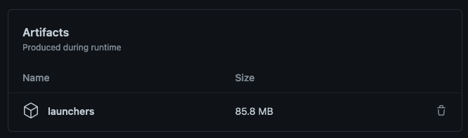

# Codacy People CSV

Script to download a CSV file with all the people in your organization

## Installation

For now the binary is hosted in the Github Actions artifacts.
You need to go to [Actions](https://github.com/codacy/codacy-people-csv/actions) and click to the last green commit
then you can scroll to the bottom and download the launchers archive:


https://github.com/codacy/codacy-people-csv/actions/runs/4203856913

Then you need to give executable permissions:

```
chmod +x codacy-people-csv-apple-darwin
```

## Usage

Once downloaded for your operative system, you can run it with:

```
./codacy-people-csv-apple-darwin --provider gh --organization codacy --token $CODACY_API_TOKEN
```

And it will print the path of the file it created.
